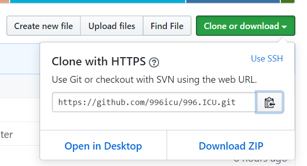

项目基础及工具
==========================

-----------

[TOC]


## GIT简介

1. 什么是GIT

> git是一个开源的分布式版本控制系统，用于高效的管理各种大小项目和文件。

2. 代码管理工具的用途

>* 防止代码丢失，做备份
>* 项目的版本管理和控制，可以通过设置节点进行跳转
>* 建立各自的开发环境分支，互不影响，方便合并
>* 在多终端开发时，方便代码的相互传输

3. git的特点

>* git是开源的，多在*nix下使用，可以管理各种文件
>* git是分布式的项目管理工具(svn是集中式的)
>* git数据管理更多样化，分享速度快，数据安全
>* git 拥有更好的分支支持，方便多人协调

4. git安装

> sudo apt-get install git

## GIT使用


### 基本概念

* 工作区：项目所在操作目录，实际操作项目的区域
* 暂存区: 用于记录工作区的工作（修改）内容
* 仓库区: 用于备份工作区的内容
* 远程仓库: 远程主机上的GIT仓库

>注意： 在本地仓库中，git总是希望工作区的内容与仓库区保持一致，而且只有仓库区的内容才能和其他远程仓库交互。

### 初始配置

>配置命令: git config

>* 配置所有用户： git config --system [选项]
>> 配置文件位置:  /etc/gitconfig

>* 配置当前用户： git config --global [选项]
>> 配置文件位置:  ~/.gitconfig

>* 配置当前项目： git config  [选项]
>> 配置文件位置:  project/.git/config

1. 配置用户名

```
e.g. 将用户名设置为Tedu
sudo git config --system user.name Tedu
```

2. 配置用户邮箱

```
e.g. 将邮箱设置为lvze@tedu.cn
git config --global user.email lvze@tedu.cn
```

3. 配置编译器

```
e.g. 配置编译器为pycharm
git config core.editor pycharm

```

4. 查看配置信息

```
git config --list
```

### 基本命令

1. 初始化仓库

> git  init 
> 意义：将某个项目目录变为git操作目录，生成git本地仓库。即该项目目录可以使用git管理

2. 查看本地仓库状态

> git  status
> 说明: 初始化仓库后默认工作在master分支，当工作区与仓库区不一致时会有提示。

3. 将工作内容记录到暂存区

> git add [files..]

```
e.g. 将 a ，b 记录到暂存区
git add  a b

e.g. 将所有文件（不包含隐藏文件）记录到暂存区
git add  *
```


####@扩展延伸
在Git项目中可以通过在项目的某个文件夹下定义.gitignore文件的方式，规定相应的忽略规则，用来管理当前文件夹下的文件的Git提交行为。.gitignore 文件是可以提交到公有仓库中，这就为该项目下的所有开发者都共享一套定义好的忽略规则。在.gitingore 文件中，遵循相应的语法，在每一行指定一个忽略规则。

```
.gitignore忽略规则简单说明

file            表示忽略file文件
*.a             表示忽略所有 .a 结尾的文件
!lib.a          表示但lib.a除外
build/          表示忽略 build/目录下的所有文件，过滤整个build文件夹；

```

4.取消文件暂存记录

>  git rm --cached [file] 

5. 将文件同步到本地仓库

> git commit [file] -m [message]
> 说明: -m表示添加一些同步信息，表达同步内容

```
e.g.  将暂存区所有记录同步到仓库区
git commit  -m 'add files'
```

6. 查看commit 日志记录

> git log
> git log --pretty=oneline

7. 比较工作区文件和仓库文件差异

> git diff  [file]

8. 将暂存区或者某个commit点文件恢复到工作区

> git checkout [commit] -- [file]
>
> * --是为了防止误操作，checkout还有切换分支的作用

9. 移动或者删除文件

> git  mv  [file] [path]
> git  rm  [files]
> 注意: 这两个操作会修改工作区内容，同时将操作记录提交到暂存区。

------------------------------

### 版本控制

1. 退回到上一个commit节点

> git reset --hard HEAD^
> 注意 ： 一个^表示回退1个版本，依次类推。当版本回退之后工作区会自动和当前commit版本保持一致

2. 退回到指定的commit_id节点

> git reset --hard [commit_id]

3. 查看所有操作记录

>git reflog
>注意:最上面的为最新记录，可以利用commit_id去往任何操作位置

4. 创建标签

>标签: 在项目的重要commit位置添加快照，保存当时的工作状态，一般用于版本的迭代。

> git  tag  [tag_name] [commit_id] -m  [message]
> 说明: commit_id可以不写则默认标签表示最新的commit_id位置，message也可以不写，但是最好添加。

```
e.g. 在最新的commit处添加标签v1.0
git tag v1.0 -m '版本1'
```

5. 查看标签

>git tag  查看标签列表
>git show [tag_name]  查看标签详细信息

6. 去往某个标签节点

> git reset --hard [tag]

7. 删除标签

> git tag -d  [tag]


### 保存工作区

1.  保存工作区内容

> git stash save [message]
> 说明: 将工作区未提交的修改封存，让工作区回到修改前的状态

2. 查看工作区列表

> git stash  list
> 说明:最新保存的工作区在最上面

3. 应用某个工作区

> git stash  apply  [stash@{n}]

4. 删除工作区

> git stash drop [stash@{n}]  删除某一个工作区
> git stash clear  删除所有保存的工作区


### 分支管理

>定义: 分支即每个人在原有代码（分支）的基础上建立自己的工作环境，单独开发，互不干扰。完成开发工作后再进行分支统一合并。

1. 查看分支情况

> git branch
> 说明: 前面带 * 的分支表示当前工作分支

2. 创建分支

> git branch [branch_name]
> 说明: 基于a分支创建b分支，此时b分支会拥有a分支全部内容。在创建b分支时最好保持a分支"干净"状态。

3. 切换工作分支

> git checkout [branch]
> 说明: 2,3可以同时操作，即创建并切换分支
>
> > git checkout -b [branch_name]

4. 合并分支

> git merge [branch]

> 冲突问题是合并分支过程中最为棘手的问题
>> 当分支合并时，原分支和以前发生了变化就会产生冲突
>> 当合并分支时添加新的模块（文件），这种冲突可以自动解决，只需自己决定commit操作即可。
>> 当合并分支时两个分支修改了同一个文件，则需要手动解决冲突。

5. 删除分支

> git branch -d [branch]  删除分支
> git branch -D [branch]  删除没有被合并的分支


### 远程仓库

> 远程主机上的git仓库。实际上git是分布式结构，每台主机的git仓库结构类似，只是把别人主机上的git仓库称为远程仓库。

### GitHub介绍

>github是一个开源的项目社区网站，拥有全球最多的开源项目。开发者可以注册网站在github建立自己的项目仓库。

>网址： github.com

>代码管理工具：git

### 获取项目

* 在左上角搜索栏搜索想要的获取的项目


* 选择项目后复制项目git地址



* 在本地使用git clone方法即可获取

```
git clone https://github.com/xxxxxxxxx
```

> 注意： 获取到本地的项目会自动和github远程仓库建立连接。且获取的项目本身也是个git项目。

### 创建删除git仓库

* 点击右上角加号下拉菜单，选择新的仓库


* 填写相应的项目信息即可

* github仓库相对本地主机就是一个远程仓库 通过remote连接，如果需要输入密码输入github密码即可。连接后即可使用远程仓库操作命令操作。readme文件会被自动作为项目介绍
  
* 如果是在自己的仓库界面选择settings，在最后可以选择删除仓库。


### 远程仓库操作命令

所有操作在本地git仓库下进行

1. 添加远程仓库

```
git remote  add origin https://github.com/xxxxxxxxx
```

2. 查看连接的主机

>git remote
>注意: 一个git项目连接的远程主机名不会重复

3. 删除远程主机

>git remote rm [origin]

4. 将本地分支推送给远程仓库

将master分支推送给origin主机远程仓库，第一次推送分支使用-u表示与远程对应分支建立自动关联
```
git push -u origin  master
```
5. 推送代码到远程仓库

```
git push
```

6. 推送标签

> git push origin [tag]  推送本地标签到远程

> git push origin --tags  推送本地所有标签到远程

7. 推送旧的版本

> git push --force origin  用于本地版本比远程版本旧时强行推送本地版本

5. 删除远程分支和标签

> git branch -a  查看所有分支
> git push origin  [:branch]  删除远程分支
> git push origin --delete tag  [tagname]  删除远程仓库标签

7. 从远程获取代码

获取远程分支代码
> git pull 

将远程分支master拉取到本地，作为tmp分支
> git fetch origin  master:tmp  

> 区别
>> pull将远程内容直接拉取到本地，并和对应分支内容进行合并
>> fetch将远程分支内容拉取到本地，但是不会和本地对应分支合并，可以自己判断后再使用merge合并。


## 软件项目开发流程

```
需求分析 ----》 概要设计  ---》 项目计划 ----》详细设计---》编码测试 -----》项目测试 ----》调试修改 ---》项目发布----》后期维护
```

>需求分析 ： 确定用户的真实需求 
>>1. 确定用户的真实需求，项目的基本功能
>>2. 确定项目的整体难度和可行性分析
>>3. 需求分析文档，用户确认

>概要设计：对项目进行初步分析和整体设计
>>1. 确定功能模块
>>2. 进行可行性分析 搭建整体架构图
>>3. 确定技术思路和使用框架
>>4. 形成概要文档指导开发流程

>项目计划 ： 确定项目开发的时间轴和流程
>>1. 确定开发工作的先后顺序
>>2. 确定时间轴  ，事件里程碑
>>3. 人员分工 
>>4. 形成甘特图和思维导图等辅助内容

>详细设计 ： 项目的具体实现
>
>>1.形成详细设计文档 ： 思路，逻辑流程，功能说明，技术点说明，数据结构说明，代码说明

>编码测试 ： 按照预定计划实现代码编写，并且做基本检测
>>1. 代码编写
>>2. 写测试程序
>>3. 技术攻关

>项目测试 ： 对项目按照功能进行测试
>>1. 跨平台测试 ，使用测试
>>2. 根据测试报告进行代码修改
>>3. 完成测试报告

>项目发布
>>1.项目交付用户进行发布
>>2.编写项目说明文档

>后期维护
>>1.维护项目正常运转
>>2.进行项目的迭代升级

### 项目注意事项
* 按时完成项目工作和项目时间不足之间的冲突
* 项目实施人员之间的冲突

### 项目工具的使用
编写文档： word  ppt  excel  markdown   LaTex
项目流程图 ： Mindmanager  visio
项目管理 ： project
代码管理 ： svn   git

# Git 的命令行接口

为了避免重复信息，我们将不会详细解释以下命令行。强烈推荐您阅读 [Pro Git 中文版](https://git-scm.com/book/zh/v2)或可以观看本讲座的视频来学习。

## 基础

- `git help <command>`: 获取 git 命令的帮助信息

- `git init`: 创建一个新的 git 仓库，其数据会存放在一个名为 `.git` 的目录下

- `git status`: 显示当前的仓库状态

- `git add <filename>`: 添加文件到暂存区

- ```plaintext
  git commit
  ```

  : 创建一个新的提交

  - 如何编写 [良好的提交信息](https://tbaggery.com/2008/04/19/a-note-about-git-commit-messages.html)!
  - 为何要 [编写良好的提交信息](https://chris.beams.io/posts/git-commit/)

- `git log`: 显示历史日志

- `git log --all --graph --decorate`: 可视化历史记录（有向无环图）

- `git diff <filename>`: 显示与暂存区文件的差异

- `git diff <revision> <filename>`: 显示某个文件两个版本之间的差异

- `git checkout <revision>`: 更新 HEAD 和目前的分支

## 分支和合并

- `git branch`: 显示分支

- `git branch <name>`: 创建分支

- ```plaintext
  git checkout -b <name>
  ```

  : 创建分支并切换到该分支

  - 相当于 `git branch <name>; git checkout <name>`

- `git merge <revision>`: 合并到当前分支

- `git mergetool`: 使用工具来处理合并冲突

- `git rebase`: 将一系列补丁变基（rebase）为新的基线

## 远端操作

- `git remote`: 列出远端
- `git remote add <name> <url>`: 添加一个远端
- `git push <remote> <local branch>:<remote branch>`: 将对象传送至远端并更新远端引用
- `git branch --set-upstream-to=<remote>/<remote branch>`: 创建本地和远端分支的关联关系
- `git fetch`: 从远端获取对象/索引
- `git pull`: 相当于 `git fetch; git merge`
- `git clone`: 从远端下载仓库

## 撤销

- `git commit --amend`: 编辑提交的内容或信息
- `git reset HEAD <file>`: 恢复暂存的文件
- `git checkout -- <file>`: 丢弃修改

# Git 高级操作

- `git config`: Git 是一个 [高度可定制的](https://git-scm.com/docs/git-config) 工具
- `git clone --depth=1`: 浅克隆（shallow clone），不包括完整的版本历史信息
- `git add -p`: 交互式暂存
- `git rebase -i`: 交互式变基
- `git blame`: 查看最后修改某行的人
- `git stash`: 暂时移除工作目录下的修改内容
- `git bisect`: 通过二分查找搜索历史记录
- `.gitignore`: [指定](https://git-scm.com/docs/gitignore) 故意不追踪的文件
