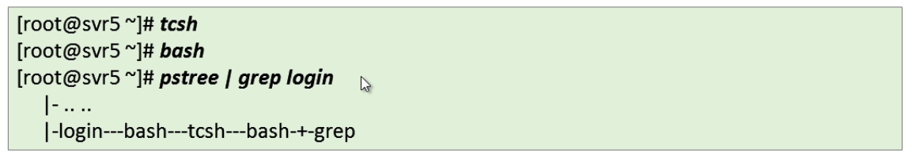

# shell

### 什么是shell？

1、工作在Linux内核与用户之间的解释程序

​		-相当于操作系统的“外壳”

​		-向Linux内核传达用户指令的“翻译官”

​		-通常指BASH(/bin/bash)

2、Windows下的shell解释器

​		-C:\Windows\System32\cmd.exe


### 登录shell环境

作为用户登录后的第一个程序

​		-即最常见的“linux命令行”环境

​		-以交互方式运行，用户每输入一个命令行，立即解释并释放


### 手动选择shell环境

直接执行指定的解释器程序

​		-常见的shell：bash、zsh、tcsh

​		-相当于新建一个子环境



### 交互式 VS 非交互式

**交互式**

​		-人工干预、智能化程度高

​		-逐条解释执行、效率低

**非交互式**

​		-需要提前设计、智能化难度大

​		-批量执行、效率高

​		-方便在后台静悄悄的运行

### 什么是脚本？

提前写好可执行代码，用来完成特定任务的文件

​	-顺序、批处理

​	-解释型程序

**常见的脚本语言**

Bash Shell / Python / Perl / Ruby /  JSP / PHP / APS / CGI / JavaScript

### 脚本的创建过程

·如何写出自己的第一个shell脚本

​		-1、理清任务                     ---自然语言：步骤拆分、顺序化整理

​		-2、编写可执行语句          ---脚本语言:各步骤如何实现

​		-3、完善脚本 					---界面友好/结构规范、代码的优化

**1、理清任务**

案例需求

​		-新建一个名为zengye的本地用户

​		-此用户能正常登录，其密码为1234567


**2、编写可执行语句**

第一、二、……步依次如何实现

​		-使用useradd、passwd命令完成相应的任务步骤

​		-自然语言 --> 可执行的命令行


**3、完善脚本**

脚本优化目标

​		-界面友好、易读懂、易使用

​		-符合规范、方便协作/移植及代码重用

​		-代码简洁、执行效率高


### 如何运行shell脚本？

**方法1：**作为指定shell解释程序的参数

​		-sh 代码文件路径     ===     bash 代码文件路径

​		-. 代码文件路径        ===     source代码文件路径


**方法2：**作为可独立运行的脚本程序

​		-为shell代码文件添加x权限

​		-指定脚本路径即可运行


### 调试shell脚本

直接观察执行过程

​		-执行中的命令输出、报错信息

​		-与用户的交互

开启调试模式

​		-sh -x 脚本文件


插入echo断点

​		-echo ‘提示信息’....

​		-echo "Hello World"


### 免交互及输入处理

​						------常见的用法示例

**免交互处理**

需要输入交互的可执行操作

​			-passwd改密码

​			-ssh远程登录

​			-vim文本编辑器

​			-图形化的安装/配置过程

​			-……

**passwd改密的免交互**

选项  --stdin

​		-从标准输入读取密码子串

​		-可以从键盘。也可以由另一个命令给出


**忽略无关输出**

黑洞设备 /dev/null

​		-相当于只能写入、不能读出的单向文件

​		-存放到其中的数据都会丢失

​		-用法：可执行语句 &>   /dev/null


**记录错误输出**

根据需要，可以将出错信息保存到指定文件

​			-针对后台脚本的有效排错手段

​			-适用于不便交互但又需要查看报错的情况

​			-用法：可执行语句  2> /路径/文件


#### 对第一个shell脚本的完善

免交互处理、友好输出

​		-批量应用时方便在后台执行


#### 在shell中导航

shell 中的路径是一组被分割的目录，在 Linux 和 macOS 上使用 `/` 分割，而在Windows上是 `\`。路径 `/` 代表的是系统的根目录，所有的文件夹都包括在这个路径之下，在Windows上每个盘都有一个根目录（例如： `C:\`）。 我们假设您在学习本课程时使用的是 Linux 文件系统。如果某个路径以 `/` 开头，那么它是一个 *绝对路径*，其他的都是 *相对路径* 。相对路径是指相对于当前工作目录的路径，当前工作目录可以使用 `pwd` 命令来获取。此外，切换目录需要使用 `cd` 命令。在路径中，`.` 表示的是当前目录，而 `..` 表示上级目录：

```shell
missing:~$ pwd
/home/missing
missing:~$ cd /home
missing:/home$ pwd
/home
missing:/home$ cd ..
missing:/$ pwd
/
missing:/$ cd ./home
missing:/home$ pwd
/home
missing:/home$ cd missing
missing:~$ pwd
/home/missing
missing:~$ ../../bin/echo hello
hello
```

注意，shell 会实时显示当前的路径信息。您可以通过配置 shell 提示符来显示各种有用的信息，这一内容我们会在后面的课程中进行讨论。

一般来说，当我们运行一个程序时，如果我们没有指定路径，则该程序会在当前目录下执行。例如，我们常常会搜索文件，并在需要时创建文件。

为了查看指定目录下包含哪些文件，我们使用 `ls` 命令：

```shell
missing:~$ ls
missing:~$ cd ..
missing:/home$ ls
missing
missing:/home$ cd ..
missing:/$ ls
bin
boot
dev
etc
home
...
```

除非我们利用第一个参数指定目录，否则 `ls` 会打印当前目录下的文件。大多数的命令接受标记和选项（带有值的标记），它们以 `-` 开头，并可以改变程序的行为。通常，在执行程序时使用 `-h` 或 `--help` 标记可以打印帮助信息，以便了解有哪些可用的标记或选项。例如，`ls --help` 的输出如下：

```shell
missing:~$ ls -l /home
drwxr-xr-x 1 missing  users  4096 Jun 15  2019 missing
```

这个参数可以打印出更加详细地列出目录下文件或文件夹的信息。首先，本行第一个字符 `d` 表示 `missing` 是一个目录。然后接下来的九个字符，每三个字符构成一组。 （`rwx`）. 它们分别代表了文件所有者（`missing`），用户组（`users`） 以及其他所有人具有的权限。其中 `-` 表示该用户不具备相应的权限。从上面的信息来看，只有文件所有者可以修改（`w`），`missing`文件夹 （例如，添加或删除文件夹中的文件）。为了进入某个文件夹，用户需要具备该文件夹以及其父文件夹的“搜索”权限（以“可执行”：`x`）权限表示。为了列出它的包含的内容，用户必须对该文件夹具备读权限（`r`）。对于文件来说，权限的意义也是类似的。注意，`/bin` 目录下的程序在最后一组，即表示所有人的用户组中，均包含 `x` 权限，也就是说任何人都可以执行这些程序。

在这个阶段，还有几个趁手的命令是您需要掌握的，例如 `mv`（用于重命名或移动文件）、 `cp`（拷贝文件）以及 `mkdir`（新建文件夹）。

如果您想要知道关于程序参数、输入输出的信息，亦或是想要了解它们的工作方式，请试试 `man` 这个程序。它会接受一个程序名作为参数，然后将它的文档（用户手册）展现给您。注意，使用 `q` 可以退出该程序。

```shell
missing:~$ man ls
```

在 shell 中，程序有两个主要的“流”：它们的输入流和输出流。 当程序尝试读取信息时，它们会从输入流中进行读取，当程序打印信息时，它们会将信息输出到输出流中。 通常，一个程序的输入输出流都是您的终端。也就是，您的键盘作为输入，显示器作为输出。 但是，我们也可以重定向这些流！

最简单的重定向是 `< file` 和 `> file`。这两个命令可以将程序的输入输出流分别重定向到文件：

```shell
missing:~$ echo hello > hello.txt
missing:~$ cat hello.txt
hello
missing:~$ cat < hello.txt
hello
missing:~$ cat < hello.txt > hello2.txt
missing:~$ cat hello2.txt
hello
```

还可以使用 `>>` 来向一个文件追加内容。使用管道（ *pipes* ），我们能够更好的利用文件重定向。 `|` 操作符允许我们将一个程序的输出和另外一个程序的输入连接起来：

```shell
missing:~$ ls -l / | tail -n1
drwxr-xr-x 1 root  root  4096 Jun 20  2019 var
missing:~$ curl --head --silent google.com | grep --ignore-case content-length | cut --delimiter=' ' -f2
219
```

#### Shell 脚本

到目前为止，我们已经学习来如何在shell中执行命令，并使用管道将命令组合使用。但是，很多情况下我们需要执行一系列的操作并使用条件或循环这样的控制流。

shell脚本是一种更加复杂度的工具。

大多数shell都有自己的一套脚本语言，包括变量、控制流和自己的语法。shell脚本与其他脚本语言不同之处在于，shell脚本针对shell所从事的相关工作进行来优化。因此，创建命令流程（pipelines）、将结果保存到文件、从标准输入中读取输入，这些都是shell脚本中的原生操作，这让它比通用的脚本语言更易用。本节中，我们会专注于bash脚本，因为它最流行，应用更为广泛。

在bash中为变量赋值的语法是`foo=bar`，访问变量中存储的数值，其语法为 `$foo`。 需要注意的是，`foo = bar` （使用空格隔开）是不能正确工作的，因为解释器会调用程序`foo` 并将 `=` 和 `bar`作为参数。 总的来说，在shell脚本中使用空格会起到分割参数的作用，有时候可能会造成混淆，请务必多加检查。

Bash中的字符串通过`'` 和 `"`分隔符来定义，但是它们的含义并不相同。以`'`定义的字符串为原义字符串，其中的变量不会被转义，而 `"`定义的字符串会将变量值进行替换。

```shell
foo=bar
echo "$foo"
# 打印 bar
echo '$foo'
# 打印 $foo
```

和其他大多数的编程语言一样，`bash`也支持`if`, `case`, `while` 和 `for` 这些控制流关键字。同样地， , `bash` 也支持函数，它可以接受参数并基于参数进行操作。下面这个函数是一个例子，它会创建一个文件夹并使用`cd`进入该文件夹。

```shell
mcd () {
    mkdir -p "$1"
    cd "$1"
}
```

这里 `$1` 是脚本的第一个参数。与其他脚本语言不同的是，bash使用了很多特殊的变量来表示参数、错误代码和相关变量。下面是列举来其中一些变量，更完整的列表可以参考 [这里](https://www.tldp.org/LDP/abs/html/special-chars.html)。

- `$0` - 脚本名
- `$1` 到 `$9` - 脚本的参数。 `$1` 是第一个参数，依此类推。
- `$@` - 所有参数
- `$#` - 参数个数
- `$?` - 前一个命令的返回值
- `$$` - 当前脚本的进程识别码
- `!!` - 完整的上一条命令，包括参数。常见应用：当你因为权限不足执行命令失败时，可以使用 `sudo !!`再尝试一次。
- `$_` - 上一条命令的最后一个参数。如果你正在使用的是交互式shell，你可以通过按下 `Esc` 之后键入 . 来获取这个值。

命令通常使用 `STDOUT`来返回输出值，使用`STDERR` 来返回错误及错误码，便于脚本以更加友好的方式报告错误。 返回码或退出状态是脚本/命令之间交流执行状态的方式。返回值0表示正常执行，其他所有非0的返回值都表示有错误发生。

退出码可以搭配`&&` (与操作符) 和 `||` (或操作符)使用，用来进行条件判断，决定是否执行其他程序。它们都属于短路[运算符](https://en.wikipedia.org/wiki/Short-circuit_evaluation)（short-circuiting） 同一行的多个命令可以用` ; `分隔。程序 `true` 的返回码永远是`0`，`false` 的返回码永远是`1`。让我们看几个例子

```shell
false || echo "Oops, fail"
# Oops, fail

true || echo "Will not be printed"
#

true && echo "Things went well"
# Things went well

false && echo "Will not be printed"
#

false ; echo "This will always run"
# This will always run
```

另一个常见的模式是以变量的形式获取一个命令的输出，这可以通过 *命令替换* (*command substitution*)实现。

当您通过 `$( CMD )` 这样的方式来执行`CMD` 这个命令时，它的输出结果会替换掉 `$( CMD )` 。例如，如果执行 `for file in $(ls)` ，shell首先将调用`ls` ，然后遍历得到的这些返回值。还有一个冷门的类似特性是 *进程替换*（*process substitution*）， `<( CMD )` 会执行 `CMD` 并将结果输出到一个临时文件中，并将 `<( CMD )` 替换成临时文件名。这在我们希望返回值通过文件而不是STDIN传递时很有用。例如， `diff <(ls foo) <(ls bar)` 会显示文件夹 `foo` 和 `bar` 中文件的区别。

说了很多，现在该看例子了，下面这个例子展示了一部分上面提到的特性。这段脚本会遍历我们提供的参数，使用`grep` 搜索字符串 `foobar`，如果没有找到，则将其作为注释追加到文件中。

```shell
#!/bin/bash

echo "Starting program at $(date)" # date会被替换成日期和时间

echo "Running program $0 with $# arguments with pid $$"

for file in "$@"; do
    grep foobar "$file" > /dev/null 2> /dev/null
    # 如果模式没有找到，则grep退出状态为 1
    # 我们将标准输出流和标准错误流重定向到Null，因为我们并不关心这些信息
    if [[ $? -ne 0 ]]; then
        echo "File $file does not have any foobar, adding one"
        echo "# foobar" >> "$file"
    fi
done
```

在条件语句中，我们比较 `$?` 是否等于0。 Bash实现了许多类似的比较操作，您可以查看 [`test 手册`](https://man7.org/linux/man-pages/man1/test.1.html)。 在bash中进行比较时，尽量使用双方括号 `[[ ]]` 而不是单方括号 `[ ]`，这样会降低犯错的几率，尽管这样并不能兼容 `sh`。 更详细的说明参见[这里](http://mywiki.wooledge.org/BashFAQ/031)。

当执行脚本时，我们经常需要提供形式类似的参数。bash使我们可以轻松的实现这一操作，它可以基于文件扩展名展开表达式。这一技术被称为shell的 *通配*（ *globbing*）

- 通配符 - 当你想要利用通配符进行匹配时，你可以分别使用 `?` 和 `*` 来匹配一个或任意个字符。例如，对于文件`foo`, `foo1`, `foo2`, `foo10` 和 `bar`, `rm foo?`这条命令会删除`foo1` 和 `foo2` ，而`rm foo*` 则会删除除了`bar`之外的所有文件。
- 花括号`{}` - 当你有一系列的指令，其中包含一段公共子串时，可以用花括号来自动展开这些命令。这在批量移动或转换文件时非常方便。

```shell
convert image.{png,jpg}
# 会展开为
convert image.png image.jpg

cp /path/to/project/{foo,bar,baz}.sh /newpath
# 会展开为
cp /path/to/project/foo.sh /path/to/project/bar.sh /path/to/project/baz.sh /newpath

# 也可以结合通配使用
mv *{.py,.sh} folder
# 会移动所有 *.py 和 *.sh 文件

mkdir foo bar

# 下面命令会创建foo/a, foo/b, ... foo/h, bar/a, bar/b, ... bar/h这些文件
touch {foo,bar}/{a..h}
touch foo/x bar/y
# 比较文件夹 foo 和 bar 中包含文件的不同
diff <(ls foo) <(ls bar)
# 输出
# < x
# ---
# > y
```

编写 `bash` 脚本有时候会很别扭和反直觉。例如 [shellcheck](https://github.com/koalaman/shellcheck)这样的工具可以帮助你定位sh/bash脚本中的错误。

注意，脚本并不一定只有用bash写才能在终端里调用。比如说，这是一段Python脚本，作用是将输入的参数倒序输出：

```shell
#!/usr/local/bin/python
import sys
for arg in reversed(sys.argv[1:]):
    print(arg)
```

内核知道去用python解释器而不是shell命令来运行这段脚本，是因为脚本的开头第一行的[shebang](https://en.wikipedia.org/wiki/Shebang_(Unix))。

在 `shebang` 行中使用 [`env`](https://man7.org/linux/man-pages/man1/env.1.html) 命令是一种好的实践，它会利用环境变量中的程序来解析该脚本，这样就提高来您的脚本的可移植性。`env` 会利用我们第一节讲座中介绍过的`PATH` 环境变量来进行定位。 例如，使用了`env`的shebang看上去时这样的`#!/usr/bin/env python`。

shell函数和脚本有如下一些不同点：

- 函数只能用与shell使用相同的语言，脚本可以使用任意语言。因此在脚本中包含 `shebang` 是很重要的。
- 函数仅在定义时被加载，脚本会在每次被执行时加载。这让函数的加载比脚本略快一些，但每次修改函数定义，都要重新加载一次。
- 函数会在当前的shell环境中执行，脚本会在单独的进程中执行。因此，函数可以对环境变量进行更改，比如改变当前工作目录，脚本则不行。脚本需要使用 [`export`](httsp://man7.org/linux/man-pages/man1/export.1p.html) 将环境变量导出，并将值传递给环境变量。
- 与其他程序语言一样，函数可以提高代码模块性、代码复用性并创建清晰性的结构。shell脚本中往往也会包含它们自己的函数定义。

# Shell 工具

## 查看命令如何使用

看到这里，您可能会有疑问，我们应该如何为特定的命令找到合适的标记呢？例如 `ls -l`, `mv -i` 和 `mkdir -p`。更普遍的是，给您一个命令行，您应该怎样了解如何使用这个命令行并找出它的不同的选项呢？ 一般来说，您可能会先去网上搜索答案，但是，UNIX 可比 StackOverflow 出现的早，因此我们的系统里其实早就包含了可以获取相关信息的方法。

在上一节中我们介绍过，最常用的方法是为对应的命令行添加`-h` 或 `--help` 标记。另外一个更详细的方法则是使用`man` 命令。[`man`](https://man7.org/linux/man-pages/man1/man.1.html) 命令是手册（manual）的缩写，它提供了命令的用户手册。

例如，`man rm` 会输出命令 `rm` 的说明，同时还有其标记列表，包括之前我们介绍过的`-i`。 事实上，目前我们给出的所有命令的说明链接，都是网页版的Linux命令手册。即使是您安装的第三方命令，前提是开发者编写了手册并将其包含在了安装包中。在交互式的、基于字符处理的终端窗口中，一般也可以通过 `:help` 命令或键入 `?`来获取帮助。

有时候手册内容太过详实，让我们难以在其中查找哪些最常用的标记和语法。 [TLDR pages](https://tldr.sh/) 是一个很不错的替代品，它提供了一些案例，可以帮助您快速找到正确的选项。

例如，自己就常常在tldr上搜索[`tar`](https://tldr.ostera.io/tar) 和 [`ffmpeg`](https://tldr.ostera.io/ffmpeg) 的用法。

## 查找文件

程序员们面对的最常见的重复任务就是查找文件或目录。所有的类UNIX系统都包含一个名为 [`find`](https://man7.org/linux/man-pages/man1/find.1.html)的工具，它是shell上用于查找文件的绝佳工具。`find`命令会递归地搜索符合条件的文件，例如：

```shell
# 查找所有名称为src的文件夹
find . -name src -type d
# 查找所有文件夹路径中包含test的python文件
find . -path '*/test/*.py' -type f
# 查找前一天修改的所有文件
find . -mtime -1
# 查找所有大小在500k至10M的tar.gz文件
find . -size +500k -size -10M -name '*.tar.gz'
```

除了列出所寻找的文件之外，find还能对所有查找到的文件进行操作。这能极大地简化一些单调的任务。

```shell
# 删除全部扩展名为.tmp 的文件
find . -name '*.tmp' -exec rm {} \;
# 查找全部的 PNG 文件并将其转换为 JPG
find . -name '*.png' -exec convert {} {}.jpg \;
```

尽管 `find` 用途广泛，它的语法却比较难以记忆。例如，为了查找满足模式 `PATTERN` 的文件，您需要执行 `find -name '*PATTERN*'` (如果您希望模式匹配时是不区分大小写，可以使用`-iname`选项）

您当然可以使用alias设置别名来简化上述操作，但shell的哲学之一便是寻找（更好用的）替代方案。 记住，shell最好的特性就是您只是在调用程序，因此您只要找到合适的替代程序即可（甚至自己编写）。

例如， [`fd`](https://github.com/sharkdp/fd) 就是一个更简单、更快速、更友好的程序，它可以用来作为`find`的替代品。它有很多不错的默认设置，例如输出着色、默认支持正则匹配、支持unicode并且我认为它的语法更符合直觉。以模式`PATTERN` 搜索的语法是 `fd PATTERN`。

大多数人都认为 `find` 和 `fd` 已经很好用了，但是有的人可能想知道，我们是不是可以有更高效的方法，例如不要每次都搜索文件而是通过编译索引或建立数据库的方式来实现更加快速地搜索。

这就要靠 [`locate`](https://man7.org/linux/man-pages/man1/locate.1.html) 了。 `locate` 使用一个由 [`updatedb`](https://man7.org/linux/man-pages/man1/updatedb.1.html)负责更新的数据库，在大多数系统中 `updatedb` 都会通过 [`cron`](https://man7.org/linux/man-pages/man8/cron.8.html)每日更新。这便需要我们在速度和时效性之间作出权衡。而且，`find` 和类似的工具可以通过别的属性比如文件大小、修改时间或是权限来查找文件，`locate`则只能通过文件名。 [here](https://unix.stackexchange.com/questions/60205/locate-vs-find-usage-pros-and-cons-of-each-other)有一个更详细的对比。

## 查找代码

查找文件是很有用的技能，但是很多时候您的目标其实是查看文件的内容。一个最常见的场景是您希望查找具有某种模式的全部文件，并找它们的位置。

为了实现这一点，很多类UNIX的系统都提供了[`grep`](https://man7.org/linux/man-pages/man1/grep.1.html)命令，它是用于对输入文本进行匹配的通用工具。它是一个非常重要的shell工具，我们会在后续的数据清理课程中深入的探讨它。

`grep` 有很多选项，这也使它成为一个非常全能的工具。其中我经常使用的有 `-C` ：获取查找结果的上下文（Context）；`-v` 将对结果进行反选（Invert），也就是输出不匹配的结果。举例来说， `grep -C 5` 会输出匹配结果前后五行。当需要搜索大量文件的时候，使用 `-R` 会递归地进入子目录并搜索所有的文本文件。

但是，我们有很多办法可以对 `grep -R` 进行改进，例如使其忽略`.git` 文件夹，使用多CPU等等。

因此也出现了很多它的替代品，包括 [ack](https://beyondgrep.com/), [ag](https://github.com/ggreer/the_silver_searcher) 和 [rg](https://github.com/BurntSushi/ripgrep)。它们都特别好用，但是功能也都差不多，我比较常用的是 ripgrep (`rg`) ，因为它速度快，而且用法非常符合直觉。例子如下：

```shell
# 查找所有使用了 requests 库的文件
rg -t py 'import requests'
# 查找所有没有写 shebang 的文件（包含隐藏文件）
rg -u --files-without-match "^#!"
# 查找所有的foo字符串，并打印其之后的5行
rg foo -A 5
# 打印匹配的统计信息（匹配的行和文件的数量）
rg --stats PATTERN
```

与 `find`/`fd` 一样，重要的是你要知道有些问题使用合适的工具就会迎刃而解，而具体选择哪个工具则不是那么重要。

## 查找 shell 命令

目前为止，我们已经学习了如何查找文件和代码，但随着你使用shell的时间越来越久，您可能想要找到之前输入过的某条命令。首先，按向上的方向键会显示你使用过的上一条命令，继续按上键则会遍历整个历史记录。

`history` 命令允许您以程序员的方式来访问shell中输入的历史命令。这个命令会在标准输出中打印shell中的里面命令。如果我们要搜索历史记录，则可以利用管道将输出结果传递给 `grep` 进行模式搜索。 `history | grep find` 会打印包含find子串的命令。

对于大多数的shell来说，您可以使用 `Ctrl+R` 对命令历史记录进行回溯搜索。敲 `Ctrl+R` 后您可以输入子串来进行匹配，查找历史命令行。

反复按下就会在所有搜索结果中循环。在 [zsh](https://github.com/zsh-users/zsh-history-substring-search)中，使用方向键上或下也可以完成这项工作。

`Ctrl+R` 可以配合 [fzf](https://github.com/junegunn/fzf/wiki/Configuring-shell-key-bindings#ctrl-r) 使用。`fzf` 是一个通用对模糊查找工具，它可以和很多命令一起使用。这里我们可以对历史命令进行模糊查找并将结果以赏心悦目的格式输出。

另外一个和历史命令相关的技巧我喜欢称之为**基于历史的自动补全**。 这一特性最初是由 [fish](https://fishshell.com/) shell 创建的，它可以根据您最近使用过的开头相同的命令，动态地对当前对shell命令进行补全。这一功能在 [zsh](https://github.com/zsh-users/zsh-autosuggestions) 中也可以使用，它可以极大的提高用户体验。

你可以修改 shell history 的行为，例如，如果在命令的开头加上一个空格，它就不会被加进shell记录中。当你输入包含密码或是其他敏感信息的命令时会用到这一特性。 为此你需要在`.bashrc`中添加`HISTCONTROL=ignorespace`或者向`.zshrc` 添加 `setopt HIST_IGNORE_SPACE`。 如果你不小心忘了在前面加空格，可以通过编辑。`bash_history`或 `.zhistory` 来手动地从历史记录中移除那一项。

## 文件夹导航

之前对所有操作我们都默认一个前提，即您已经位于想要执行命令的目录下，但是如何才能高效地在目录 间随意切换呢？有很多简便的方法可以做到，比如设置alias，使用 [ln -s](https://man7.org/linux/man-pages/man1/ln.1.html)创建符号连接等。而开发者们已经想到了很多更为精妙的解决方案。

由于本课程的目的是尽可能对你的日常习惯进行优化。因此，我们可以使用[`fasd`](https://github.com/clvv/fasd)和[autojump](https://github.com/wting/autojump)这两个工具来查找最常用或最近使用的文件和目录。

Fasd 基于 [*frecency*](https://developer.mozilla.org/en-US/docs/Mozilla/Tech/Places/Frecency_algorithm)对文件和文件排序，也就是说它会同时针对频率（*frequency* ）和时效（ *recency*）进行排序。默认情况下，`fasd`使用命令 `z` 帮助我们快速切换到最常访问的目录。例如， 如果您经常访问`/home/user/files/cool_project` 目录，那么可以直接使用 `z cool` 跳转到该目录。对于 autojump，则使用`j cool`代替即可。

还有一些更复杂的工具可以用来概览目录结构，例如 [`tree`](https://linux.die.net/man/1/tree), [`broot`](https://github.com/Canop/broot) 或更加完整的文件管理器，例如 [`nnn`](https://github.com/jarun/nnn) 或 [`ranger`](https://github.com/ranger/ranger)。

# 编辑器 (Vim)

写作和写代码其实是两项非常不同的活动。当我们编程的时候，会经常在文件间进行切换、阅读、浏览和修改代码，而不是连续编写一大段的文字。因此代码编辑器和文本编辑器是很不同的两种工具（例如微软的 Word 与 Visual Studio Code）

作为程序员，我们大部分时间都花在代码编辑上，所以花点时间掌握某个适合自己的编辑器是非常值得的。通常学习使用一个新的编辑器包含以下步骤：

- 阅读教程（比如这节课以及我们为您提供的资源）
- 坚持使用它来完成你所有的编辑工作（即使一开始这会让你的工作效率降低）
- 随时查阅：如果某个操作看起来像是有更方便的实现方法，一般情况下真的会有。

如果您能够遵循上述步骤，并且坚持使用新的编辑器完成您所有的文本编辑任务，那么学习一个复杂的代码编辑器的过程一般是这样的：头两个小时，您会学习到编辑器的基本操作，例如打开和编辑文件、保存与退出、浏览缓冲区。当学习时间累计达到20个小时之后，您使用新编辑器的效率应该已经和使用老编辑器一样快。在此之后，其益处开始显现：有了足够的知识和肌肉记忆后，使用新编辑器将大大节省你的时间。而现代文本编辑器都是些复杂且强大的工具，永远有新东西可学：学的越多，效率越高。

# 该学哪个编辑器？

程序员们对自己正在使用的文本编辑器通常有着 [非常强的执念](https://en.wikipedia.org/wiki/Editor_war)。

现在最流行的编辑器是什么？[Stack Overflow的调查](https://insights.stackoverflow.com/survey/2019/#development-environments-and-tools)(这个调查可能并不如我们想象的那样客观，因为Stack Overflow 的用户并不能代表所有程序员)显示，[Visual Studio Code](https://code.visualstudio.com/)是目前最流行的代码编辑器。而[Vim](https://www.vim.org/) 则是最流行的基于命令行的编辑器。

## Vim

这门课的所有教员都使用Vim作为编辑器。Vim有着悠久历史；它始于1976年的Vi编辑器，到现在还在 不断开发中。Vim有很多聪明的设计思想，所以很多其他工具也支持Vim模式（比如，140万人安装了 [Vim emulation for VS code](https://github.com/VSCodeVim/Vim)）。即使你最后使用 其他编辑器，Vim也值得学习。

由于不可能在50分钟内教授Vim的所有功能，我们会专注于解释Vim的设计哲学，教你基础知识， 并展示一部分高级功能，然后给你掌握这个工具所需要的资源。

# Vim的哲学

在编程的时候，你会把大量时间花在阅读/编辑而不是在写代码上。所以，Vim 是一个_多模态_编辑 器：它对于插入文字和操纵文字有不同的模式。Vim 是可编程的（可以使用 Vimscript 或者像 Python 一样的其他程序语言），Vim 的接口本身也是一个程序语言：键入操作（以及其助记名） 是命令，这些命令也是可组合的。Vim 避免了使用鼠标，因为那样太慢了；Vim 甚至避免用 上下左右键因为那样需要太多的手指移动。

这样的设计哲学使得 Vim 成为了一个能跟上你思维速度的编辑器。

# 编辑模式

Vim的设计以大多数时间都花在阅读、浏览和进行少量编辑改动为基础，因此它具有多种操作模式：

- *正常模式*：在文件中四处移动光标进行修改
- *插入模式*：插入文本
- *替换模式*：替换文本
- *可视化（一般，行，块）模式*：选中文本块
- *命令模式*：用于执行命令

在不同的操作模式下，键盘敲击的含义也不同。比如，`x` 在插入模式会插入字母`x`，但是在正常模式 会删除当前光标所在的字母，在可视模式下则会删除选中文块。

在默认设置下，Vim会在左下角显示当前的模式。 Vim启动时的默认模式是正常模式。通常你会把大部分 时间花在正常模式和插入模式。

你可以按下 `<ESC>` （退出键） 从任何其他模式返回正常模式。 在正常模式，键入 `i` 进入插入 模式， `R` 进入替换模式， `v` 进入可视（一般）模式， `V` 进入可视（行）模式， `<C-v>` （Ctrl-V, 有时也写作 `^V`）进入可视（块）模式， `:` 进入命令模式。

因为你会在使用 Vim 时大量使用 `<ESC>` 键，所以可以考虑把大小写锁定键重定义成 `<ESC>` 键 （[MacOS 教程](https://vim.fandom.com/wiki/Map_caps_lock_to_escape_in_macOS) ）。

# 基本操作

## 插入文本

在正常模式，键入 `i` 进入插入模式。现在 Vim 跟很多其他的编辑器一样，直到你键入`<ESC>` 返回正常模式。 你只需要掌握这一点和上面介绍的所有基础知识就可以使用 Vim 来编辑文件了 （虽然如果你一直停留在插入模式内不一定高效）。

## 缓存， 标签页， 窗口

Vim 会维护一系列打开的文件，称为“缓存”。一个 Vim 会话包含一系列标签页，每个标签页包含 一系列窗口（分隔面板）。每个窗口显示一个缓存。跟网页浏览器等其他你熟悉的程序不一样的是， 缓存和窗口不是一一对应的关系；窗口只是视角。一个缓存可以在_多个_窗口打开，甚至在同一 个标签页内的多个窗口打开。这个功能其实很好用，比如在查看同一个文件的不同部分的时候。

Vim 默认打开一个标签页，这个标签也包含一个窗口。

## 命令行

在正常模式下键入 `:` 进入命令行模式。 在键入 `:` 后，你的光标会立即跳到屏幕下方的命令行。 这个模式有很多功能，包括打开，保存，关闭文件，以及 [退出 Vim](https://twitter.com/iamdevloper/status/435555976687923200)。

- `:q` 退出（关闭窗口）

- `:w` 保存（写）

- `:wq` 保存然后退出

- `:e {文件名}` 打开要编辑的文件

- `:ls` 显示打开的缓存

- ```plaintext
  :help {标题}
  ```

   

  打开帮助文档

  - `:help :w` 打开 `:w` 命令的帮助文档
  - `:help w` 打开 `w` 移动的帮助文档

# Vim 的接口其实是一种编程语言

Vim 最重要的设计思想是 Vim 的界面本身是一个程序语言。键入操作 （以及他们的助记名） 本身是命令， 这些命令可以组合使用。 这使得移动和编辑更加高效，特别是一旦形成肌肉记忆。

## 移动

多数时候你会在正常模式下，使用移动命令在缓存中导航。在 Vim 里面移动也被称为 “名词”， 因为它们指向文字块。

- 基本移动: `hjkl` （左， 下， 上， 右）

- 词： `w` （下一个词）， `b` （词初）， `e` （词尾）

- 行： `0` （行初）， `^` （第一个非空格字符）， `$` （行尾）

- 屏幕： `H` （屏幕首行）， `M` （屏幕中间）， `L` （屏幕底部）

- 翻页： `Ctrl-u` （上翻）， `Ctrl-d` （下翻）

- 文件： `gg` （文件头）， `G` （文件尾）

- 行数： `:{行数}<CR>` 或者 `{行数}G` ({行数}为行数)

- 杂项： `%` （找到配对，比如括号或者 /* */ 之类的注释对）

- 查找：

   

  ```plaintext
  f{字符}
  ```

  ，

   

  ```plaintext
  t{字符}
  ```

  ，

   

  ```plaintext
  F{字符}
  ```

  ，

   

  ```plaintext
  T{字符}
  ```

  - 查找/到 向前/向后 在本行的{字符}
  - `,` / `;` 用于导航匹配

- 搜索: `/{正则表达式}`, `n` / `N` 用于导航匹配

## 选择

可视化模式:

- 可视化：`v`
- 可视化行： `V`
- 可视化块：`Ctrl+v`

可以用移动命令来选中。

## 编辑

所有你需要用鼠标做的事， 你现在都可以用键盘：采用编辑命令和移动命令的组合来完成。 这就是 Vim 的界面开始看起来像一个程序语言的时候。Vim 的编辑命令也被称为 “动词”， 因为动词可以施动于名词。

- ```plaintext
  i
  ```

   

  进入插入模式

  - 但是对于操纵/编辑文本，不单想用退格键完成

- `O` / `o` 在之上/之下插入行

- ```plaintext
  d{移动命令}
  ```

   

  删除 {移动命令}

  - 例如， `dw` 删除词, `d$` 删除到行尾, `d0` 删除到行头。

- ```plaintext
  c{移动命令}
  ```

   

  改变 {移动命令}

  - 例如， `cw` 改变词
  - 比如 `d{移动命令}` 再 `i`

- `x` 删除字符（等同于 `dl`）

- `s` 替换字符（等同于 `xi`）

- 可视化模式 + 操作

  - 选中文字, `d` 删除 或者 `c` 改变

- `u` 撤销, `<C-r>` 重做

- `y` 复制 / “yank” （其他一些命令比如 `d` 也会复制）

- `p` 粘贴

- 更多值得学习的: 比如 `~` 改变字符的大小写

## 计数

你可以用一个计数来结合“名词”和“动词”，这会执行指定操作若干次。

- `3w` 向前移动三个词
- `5j` 向下移动5行
- `7dw` 删除7个词

## 修饰语

你可以用修饰语改变“名词”的意义。修饰语有 `i`，表示“内部”或者“在内“，和 `a`， 表示”周围“。

- `ci(` 改变当前括号内的内容
- `ci[` 改变当前方括号内的内容
- `da'` 删除一个单引号字符串， 包括周围的单引号

# 演示

这里是一个有问题的 [fizz buzz](https://en.wikipedia.org/wiki/Fizz_buzz) 实现：

```python
def fizz_buzz(limit):
    for i in range(limit):
        if i % 3 == 0:
            print('fizz')
        if i % 5 == 0:
            print('fizz')
        if i % 3 and i % 5:
            print(i)

def main():
    fizz_buzz(10)
```

我们会修复以下问题：

- 主函数没有被调用
- 从 0 而不是 1 开始
- 在 15 的整数倍的时候在不用行打印 “fizz” 和 “buzz”
- 在 5 的整数倍的时候打印 “fizz”
- 采用硬编码的参数 10 而不是从命令控制行读取参数
- 主函数没有被调用
  - `G` 文件尾
  - `o` 向下打开一个新行
  - 输入 “if **name** …”
- 从 0 而不是 1 开始
  - 搜索 `/range`
  - `ww` 向前移动两个词
  - `i` 插入文字， “1, “
  - `ea` 在 limit 后插入， “+1”
- 在新的一行 “fizzbuzz”
  - `jj$i` 插入文字到行尾
  - 加入 “, end=’’”
  - `jj.` 重复第二个打印
  - `jjo` 在 if 打开一行
  - 加入 “else: print()”
- fizz fizz
  - `ci'` 变到 fizz
- 命令控制行参数
  - `ggO` 向上打开
  - “import sys”
  - `/10`
  - `ci(` to “int(sys.argv[1])”

展示详情请观看课程视频。比较上面用 Vim 的操作和你可能使用其他程序的操作。 值得一提的是 Vim 需要很少的键盘操作，允许你编辑的速度跟上你思维的速度。

# 自定义 Vim

Vim 由一个位于 `~/.vimrc` 的文本配置文件（包含 Vim 脚本命令）。 你可能会启用很多基本 设置。

我们提供一个文档详细的基本设置，你可以用它当作你的初始设置。我们推荐使用这个设置因为 它修复了一些 Vim 默认设置奇怪行为。 **在[这儿](https://missing-semester-cn.github.io/2020/files/vimrc) 下载我们的设置，然后将它保存成 `~/.vimrc`.**

Vim 能够被重度自定义，花时间探索自定义选项是值得的。你可以参考其他人的在GitHub 上共享的设置文件，比如，你的授课人的 Vim 设置 ([Anish](https://github.com/anishathalye/dotfiles/blob/master/vimrc), [Jon](https://github.com/jonhoo/configs/blob/master/editor/.config/nvim/init.vim)(uses [neovim](https://neovim.io/)), [Jose](https://github.com/JJGO/dotfiles/blob/master/vim/.vimrc))。 有很多好的博客文章也聊到了这个话题。尽量不要复制粘贴别人的整个设置文件， 而是阅读和理解它，然后采用对你有用的部分。

# 扩展 Vim

Vim 有很多扩展插件。跟很多互联网上已经过时的建议相反，你_不_需要在 Vim 使用一个插件 管理器（从 Vim 8.0 开始）。你可以使用内置的插件管理系统。只需要创建一个 `~/.vim/pack/vendor/start/` 的文件夹，然后把插件放到这里（比如通过 `git clone`）。

以下是一些我们最爱的插件：

- [ctrlp.vim](https://github.com/ctrlpvim/ctrlp.vim): 模糊文件查找
- [ack.vim](https://github.com/mileszs/ack.vim): 代码搜索
- [nerdtree](https://github.com/scrooloose/nerdtree): 文件浏览器
- [vim-easymotion](https://github.com/easymotion/vim-easymotion): 魔术操作

我们尽量避免在这里提供一份冗长的插件列表。你可以查看讲师们的开源的配置文件 ([Anish](https://github.com/anishathalye/dotfiles), [Jon](https://github.com/jonhoo/configs), [Jose](https://github.com/JJGO/dotfiles)) 来看看我们使用的其他插件。 浏览 [Vim Awesome](https://vimawesome.com/)来了解一些很棒的插件。 这个话题也有很多博客文章：搜索 “best Vim plugins”。

# 其他程序的 Vim 模式

很多工具提供了 Vim 模式。这些 Vim 模式的质量参差不齐；取决于具体工具， 有的提供了 很多酷炫的 Vim 功能，但是大多数对基本功能支持的很好。

## Shell

如果你是一个 Bash 用户，用 `set -o vi`。如果你用 Zsh：`bindkey -v`。Fish 用 `fish_vi_key_bindings`。另外，不管利用什么 shell，你可以`export EDITOR=vim`。 这是一个用来决定当一个程序需要启动编辑时启动哪个的环境变量。 例如，`git` 会使用这个编辑器来编辑 commit 信息。

## Readline

很多程序使用 [GNU Readline](https://tiswww.case.edu/php/chet/readline/rltop.html) 库来作为 它们的命令控制行界面。Readline 也支持基本的 Vim 模式， 可以通过在 `~/.inputrc` 添加如下行开启：

```
set editing-mode vi
```

比如，在这个设置下，Python REPL 会支持 Vim 快捷键。

## 其他

甚至有 Vim 的网页浏览快捷键 [browsers](http://vim.wikia.com/wiki/Vim_key_bindings_for_web_browsers), 受欢迎的有 用于 Google Chrome 的[Vimium](https://chrome.google.com/webstore/detail/vimium/dbepggeogbaibhgnhhndojpepiihcmeb?hl=en) 和用于 Firefox 的 [Tridactyl](https://github.com/tridactyl/tridactyl)。 你甚至可以在 [Jupyter notebooks](https://github.com/lambdalisue/jupyter-vim-binding) 中用 Vim 快捷键。 [这个列表](https://reversed.top/2016-08-13/big-list-of-vim-like-software) 中列举了支持类 vim 键位绑定的软件。

# Vim 进阶

这里我们提供了一些展示这个编辑器能力的例子。我们无法把所有的这样的事情都教给你，但是你 可以在使用中学习。一个好的对策是: 当你在使用你的编辑器的时候感觉 “一定有更好的方法来做这个”， 那么很可能真的有：上网搜寻一下。

## 搜索和替换

`:s` （替换）命令（[文档](http://vim.wikia.com/wiki/Search_and_replace)）。

- ```plaintext
  %s/foo/bar/g
  ```

  - 在整个文件中将 foo 全局替换成 bar

- ```plaintext
  %s/\[.*\](\(.*\))/\1/g
  ```

  - 将有命名的 Markdown 链接替换成简单 URLs

## 多窗口

- 用 `:sp` / `:vsp` 来分割窗口
- 同一个缓存可以在多个窗口中显示。

## 宏

- `q{字符}` 来开始在寄存器`{字符}`中录制宏

- `q`停止录制

- `@{字符}` 重放宏

- 宏的执行遇错误会停止

- `{计数}@{字符}`执行一个宏{计数}次

- 宏可以递归

  - 首先用`q{字符}q`清除宏
  - 录制该宏，用 `@{字符}` 来递归调用该宏 （在录制完成之前不会有任何操作）

- 例子：将 xml 转成 json (

  file

  )

  - 一个有 “name” / “email” 键对象的数组

  - 用一个 Python 程序？

  - 用 sed / 正则表达式

    - `g/people/d`
    - `%s/<person>/{/g`
    - `%s/<name>\(.*\)<\/name>/"name": "\1",/g`
    - …

  - Vim 命令 / 宏

    - `Gdd`, `ggdd` 删除第一行和最后一行

    - 格式化最后一个元素的宏 （寄存器

       

      ```plaintext
      e
      ```

      ）

      - 跳转到有 `<name>` 的行
      - `qe^r"f>s": "<ESC>f<C"<ESC>q`

    - 格式化一个

      的宏

      - 跳转到有 `<person>` 的行
      - `qpS{<ESC>j@eA,<ESC>j@ejS},<ESC>q`

    - 格式化一个

      标签然后转到另外一个的宏

      - 跳转到有 `<person>` 的行
      - `qq@pjq`

    - 执行宏到文件尾

      - `999@q`

    - 手动移除最后的 `,` 然后加上 `[` 和 `]` 分隔符

# 数据整理

您是否曾经有过这样的需求，将某种格式存储的数据转换成另外一种格式? 肯定有过，对吧！ 这也正是我们这节课所要讲授的主要内容。具体来讲，我们需要不断地对数据进行处理，直到得到我们想要的最终结果。

在之前的课程中，其实我们已经接触到了一些数据整理的基本技术。可以这么说，每当您使用管道运算符的时候，其实就是在进行某种形式的数据整理。

例如这样一条命令 `journalctl | grep -i intel`，它会找到所有包含intel(不区分大小写)的系统日志。您可能并不认为这是数据整理，但是它确实将某种形式的数据（全部系统日志）转换成了另外一种形式的数据（仅包含intel的日志）。大多数情况下，数据整理需要您能够明确哪些工具可以被用来达成特定数据整理的目的，并且明白如何组合使用这些工具。

让我们从头讲起。既然是学习数据整理，那有两样东西自然是必不可少的：用来整理的数据以及相关的应用场景。日志处理通常是一个比较典型的使用场景，因为我们经常需要在日志中查找某些信息，这种情况下通读日志是不现实的。现在，让我们研究一下系统日志，看看哪些用户曾经尝试过登录我们的服务器：

```
ssh myserver journalctl
```

内容太多了。现在让我们把涉及 sshd 的信息过滤出来：

```
ssh myserver journalctl | grep sshd
```

注意，这里我们使用管道将一个远程服务器上的文件传递给本机的 `grep` 程序！ `ssh` 太牛了，下一节课我们会讲授命令行环境，届时我们会详细讨论 `ssh` 的相关内容。此时我们打印出的内容，仍然比我们需要的要多得多，读起来也非常费劲。我们来改进一下：

```
ssh myserver 'journalctl | grep sshd | grep "Disconnected from"' | less
```

多出来的引号是什么作用呢？这么说吧，我们的日志是一个非常大的文件，把这么大的文件流直接传输到我们本地的电脑上再进行过滤是对流量的一种浪费。因此我们采取另外一种方式，我们先在远端机器上过滤文本内容，然后再将结果传输到本机。 `less` 为我们创建来一个文件分页器，使我们可以通过翻页的方式浏览较长的文本。为了进一步节省流量，我们甚至可以将当前过滤出的日志保存到文件中，这样后续就不需要再次通过网络访问该文件了：

```
$ ssh myserver 'journalctl | grep sshd | grep "Disconnected from"' > ssh.log
$ less ssh.log
```

过滤结果中仍然包含不少没用的数据。我们有很多办法可以删除这些无用的数据，但是让我们先研究一下 `sed` 这个非常强大的工具。

`sed` 是一个基于文本编辑器`ed`构建的”流编辑器” 。在 `sed` 中，您基本上是利用一些简短的命令来修改文件，而不是直接操作文件的内容（尽管您也可以选择这样做）。相关的命令行非常多，但是最常用的是 `s`，即*替换*命令，例如我们可以这样写：

```
ssh myserver journalctl
 | grep sshd
 | grep "Disconnected from"
 | sed 's/.*Disconnected from //'
```

上面这段命令中，我们使用了一段简单的*正则表达式*。正则表达式是一种非常强大的工具，可以让我们基于某种模式来对字符串进行匹配。`s` 命令的语法如下：`s/REGEX/SUBSTITUTION/`, 其中 `REGEX` 部分是我们需要使用的正则表达式，而 `SUBSTITUTION` 是用于替换匹配结果的文本。

## 正则表达式

正则表达式非常常见也非常有用，值得您花些时间去理解它。让我们从这一句正则表达式开始学习： `/.*Disconnected from /`。正则表达式通常以（尽管并不总是） `/`开始和结束。大多数的 ASCII 字符都表示它们本来的含义，但是有一些字符确实具有表示匹配行为的“特殊”含义。不同字符所表示的含义，根据正则表达式的实现方式不同，也会有所变化，这一点确实令人沮丧。常见的模式有：

- `.` 除换行符之外的”任意单个字符”
- `*` 匹配前面字符零次或多次
- `+` 匹配前面字符一次或多次
- `[abc]` 匹配 `a`, `b` 和 `c` 中的任意一个
- `(RX1|RX2)` 任何能够匹配`RX1` 或 `RX2`的结果
- `^` 行首
- `$` 行尾

`sed` 的正则表达式有些时候是比较奇怪的，它需要你在这些模式前添加`\`才能使其具有特殊含义。或者，您也可以添加`-E`选项来支持这些匹配。

回过头我们再看`/.*Disconnected from /`，我们会发现这个正则表达式可以匹配任何以若干任意字符开头，并接着包含”Disconnected from “的字符串。这也正式我们所希望的。但是请注意，正则表达式并不容易写对。如果有人将 “Disconnected from” 作为自己的用户名会怎样呢？

```
Jan 17 03:13:00 thesquareplanet.com sshd[2631]: Disconnected from invalid user Disconnected from 46.97.239.16 port 55920 [preauth]
```

正则表达式会如何匹配？`*` 和 `+` 在默认情况下是贪婪模式，也就是说，它们会尽可能多的匹配文本。因此对上述字符串的匹配结果如下：

```
46.97.239.16 port 55920 [preauth]
```

这可不是我们想要的结果。对于某些正则表达式的实现来说，您可以给 `*`或 `+` 增加一个`?` 后缀使其变成非贪婪模式，但是很可惜 `sed` 并不支持该后缀。不过，我们可以切换到 perl 的命令行模式，该模式支持编写这样的正则表达式：

```
perl -pe 's/.*?Disconnected from //'
```

让我们回到 `sed` 命令并使用它完成后续的任务，毕竟对于这一类任务，`sed`是最常见的工具。`sed` 还可以非常方便的做一些事情，例如打印匹配后的内容，一次调用中进行多次替换搜索等。但是这些内容我们并不会在此进行介绍。`sed` 本身是一个非常全能的工具，但是在具体功能上往往能找到更好的工具作为替代品。

好的，我们还需要去掉用户名后面的后缀，应该如何操作呢？

想要匹配用户名后面的文本，尤其是当这里的用户名可以包含空格时，这个问题变得非常棘手！这里我们需要做的是匹配*一整行*：

```
 | sed -E 's/.*Disconnected from (invalid |authenticating )?user .* [^ ]+ port [0-9]+( \[preauth\])?$//'
```

让我们借助正则表达式在线调试工具[regex debugger](https://regex101.com/r/qqbZqh/2) 来理解这段表达式。OK，开始的部分和以前是一样的，随后，我们匹配两种类型的“user”（在日志中基于两种前缀区分）。再然后我们匹配属于用户名的所有字符。接着，再匹配任意一个单词（`[^ ]+` 会匹配任意非空且不包含空格的序列）。紧接着后面匹配单“port”和它后面的一串数字，以及可能存在的后缀`[preauth]`，最后再匹配行尾。

注意，这样做的话，即使用户名是“Disconnected from”，对匹配结果也不会有任何影响，您知道这是为什么吗？

问题还没有完全解决，日志的内容全部被替换成了空字符串，整个日志的内容因此都被删除了。我们实际上希望能够将用户名*保留*下来。对此，我们可以使用“捕获组（capture groups）”来完成。被圆括号内的正则表达式匹配到的文本，都会被存入一系列以编号区分的捕获组中。捕获组的内容可以在替换字符串时使用（有些正则表达式的引擎甚至支持替换表达式本身），例如`\1`、 `\2`、`\3`等等，因此可以使用如下命令：

```
 | sed -E 's/.*Disconnected from (invalid |authenticating )?user (.*) [^ ]+ port [0-9]+( \[preauth\])?$/\2/'
```

想必您已经意识到了，为了完成某种匹配，我们最终可能会写出非常复杂的正则表达式。例如，这里有一篇关于如何匹配电子邮箱地址的文章[e-mail address](https://www.regular-expressions.info/email.html)，匹配电子邮箱可一点[也不简单](https://emailregex.com/)。网络上还有很多关于如何匹配电子邮箱地址的[讨论](https://stackoverflow.com/questions/201323/how-to-validate-an-email-address-using-a-regular-expression/1917982)。人们还为其编写了[测试用例](https://fightingforalostcause.net/content/misc/2006/compare-email-regex.php)及 [测试矩阵](https://mathiasbynens.be/demo/url-regex)。您甚至可以编写一个用于判断一个数[是否为质数](https://www.noulakaz.net/2007/03/18/a-regular-expression-to-check-for-prime-numbers/)的正则表达式。

正则表达式是出了名的难以写对，但是它仍然会是您强大的常备工具之一。

## 回到数据整理

OK，现在我们有如下表达式：

```
ssh myserver journalctl
 | grep sshd
 | grep "Disconnected from"
 | sed -E 's/.*Disconnected from (invalid |authenticating )?user (.*) [^ ]+ port [0-9]+( \[preauth\])?$/\2/'
```

`sed` 还可以做很多各种各样有趣的事情，例如文本注入：(使用 `i` 命令)，打印特定的行 (使用 `p`命令)，基于索引选择特定行等等。详情请见`man sed`!

现在，我们已经得到了一个包含用户名的列表，列表中的用户都曾经尝试过登陆我们的系统。但这还不够，让我们过滤出那些最常出现的用户：

```
ssh myserver journalctl
 | grep sshd
 | grep "Disconnected from"
 | sed -E 's/.*Disconnected from (invalid |authenticating )?user (.*) [^ ]+ port [0-9]+( \[preauth\])?$/\2/'
 | sort | uniq -c
```

`sort` 会对其输入数据进行排序。`uniq -c` 会把连续出现的行折叠为一行并使用出现次数作为前缀。我们希望按照出现次数排序，过滤出最常出现的用户名：

```
ssh myserver journalctl
 | grep sshd
 | grep "Disconnected from"
 | sed -E 's/.*Disconnected from (invalid |authenticating )?user (.*) [^ ]+ port [0-9]+( \[preauth\])?$/\2/'
 | sort | uniq -c
 | sort -nk1,1 | tail -n10
```

`sort -n` 会按照数字顺序对输入进行排序（默认情况下是按照字典序排序`-k1,1` 则表示“仅基于以空格分割的第一列进行排序”。`,n` 部分表示“仅排序到第n个部分”，默认情况是到行尾。就本例来说，针对整个行进行排序也没有任何问题，我们这里主要是为了学习这一用法！

如果我们希望得到登陆次数最少的用户，我们可以使用 `head` 来代替`tail`。或者使用`sort -r`来进行倒序排序。

相当不错。但我们只想获取用户名，而且不要一行一个地显示。

```
ssh myserver journalctl
 | grep sshd
 | grep "Disconnected from"
 | sed -E 's/.*Disconnected from (invalid |authenticating )?user (.*) [^ ]+ port [0-9]+( \[preauth\])?$/\2/'
 | sort | uniq -c
 | sort -nk1,1 | tail -n10
 | awk '{print $2}' | paste -sd,
```

如果您使用的是 MacOS：注意这个命令并不能配合 MacOS 系统默认的 BSD `paste`使用。参考[课程概览与 shell](https://missing-semester-cn.github.io/2020/course-shell/)的习题内容获取更多相关信息。

我们可以利用 `paste`命令来合并行(`-s`)，并指定一个分隔符进行分割 (`-d`)，那`awk`的作用又是什么呢？

## awk – 另外一种编辑器

`awk` 其实是一种编程语言，只不过它碰巧非常善于处理文本。关于 `awk` 可以介绍的内容太多了，限于篇幅，这里我们仅介绍一些基础知识。

首先， `{print $2}` 的作用是什么？ `awk` 程序接受一个模式串（可选），以及一个代码块，指定当模式匹配时应该做何种操作。默认当模式串即匹配所有行（上面命令中当用法）。 在代码块中，`$0` 表示整行的内容，`$1` 到 `$n` 为一行中的 n 个区域，区域的分割基于 `awk` 的域分隔符（默认是空格，可以通过`-F`来修改）。在这个例子中，我们的代码意思是：对于每一行文本，打印其第二个部分，也就是用户名。

让我们康康，还有什么炫酷的操作可以做。让我们统计一下所有以`c` 开头，以 `e` 结尾，并且仅尝试过一次登陆的用户。

```
 | awk '$1 == 1 && $2 ~ /^c[^ ]*e$/ { print $2 }' | wc -l
```

让我们好好分析一下。首先，注意这次我们为 `awk`指定了一个匹配模式串（也就是`{...}`前面的那部分内容）。该匹配要求文本的第一部分需要等于1（这部分刚好是`uniq -c`得到的计数值），然后其第二部分必须满足给定的一个正则表达式。代码块中的内容则表示打印用户名。然后我们使用 `wc -l` 统计输出结果的行数。

不过，既然 `awk` 是一种编程语言，那么则可以这样：

```
BEGIN { rows = 0 }
$1 == 1 && $2 ~ /^c[^ ]*e$/ { rows += $1 }
END { print rows }
```

`BEGIN` 也是一种模式，它会匹配输入的开头（ `END` 则匹配结尾）。然后，对每一行第一个部分进行累加，最后将结果输出。事实上，我们完全可以抛弃 `grep` 和 `sed` ，因为 `awk` 就可以[解决所有问题](https://backreference.org/2010/02/10/idiomatic-awk)。至于怎么做，就留给读者们做课后练习吧。

## 分析数据

想做数学计算也是可以的！例如这样，您可以将每行的数字加起来：

```
 | paste -sd+ | bc -l
```

下面这种更加复杂的表达式也可以：

```
echo "2*($(data | paste -sd+))" | bc -l
```

您可以通过多种方式获取统计数据。如果已经安装了R语言，[`st`](https://github.com/nferraz/st)是个不错的选择：

```
ssh myserver journalctl
 | grep sshd
 | grep "Disconnected from"
 | sed -E 's/.*Disconnected from (invalid |authenticating )?user (.*) [^ ]+ port [0-9]+( \[preauth\])?$/\2/'
 | sort | uniq -c
 | awk '{print $1}' | R --slave -e 'x <- scan(file="stdin", quiet=TRUE); summary(x)'
```

R 也是一种编程语言，它非常适合被用来进行数据分析和[绘制图表](https://ggplot2.tidyverse.org/)。这里我们不会讲的特别详细， 您只需要知道`summary` 可以打印某个向量的统计结果。我们将输入的一系列数据存放在一个向量后，利用R语言就可以得到我们想要的统计数据。

如果您希望绘制一些简单的图表， `gnuplot` 可以帮助到您：

```
ssh myserver journalctl
 | grep sshd
 | grep "Disconnected from"
 | sed -E 's/.*Disconnected from (invalid |authenticating )?user (.*) [^ ]+ port [0-9]+( \[preauth\])?$/\2/'
 | sort | uniq -c
 | sort -nk1,1 | tail -n10
 | gnuplot -p -e 'set boxwidth 0.5; plot "-" using 1:xtic(2) with boxes'
```

## 利用数据整理来确定参数

有时候您要利用数据整理技术从一长串列表里找出你所需要安装或移除的东西。我们之前讨论的相关技术配合 `xargs` 即可实现：

```
rustup toolchain list | grep nightly | grep -vE "nightly-x86" | sed 's/-x86.*//' | xargs rustup toolchain uninstall
```

## 整理二进制数据

虽然到目前为止我们的讨论都是基于文本数据，但对于二进制文件其实同样有用。例如我们可以用 ffmpeg 从相机中捕获一张图片，将其转换成灰度图后通过SSH将压缩后的文件发送到远端服务器，并在那里解压、存档并显示。

```
ffmpeg -loglevel panic -i /dev/video0 -frames 1 -f image2 -
 | convert - -colorspace gray -
 | gzip
 | ssh mymachine 'gzip -d | tee copy.jpg | env DISPLAY=:0 feh -'
```

